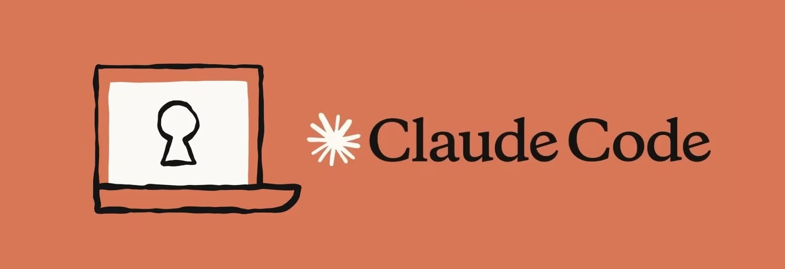

<div align="center">



# Claude Code pour les Ops

**Formation pratique à l'ingénierie assistée par agent — DevOps · SRE · Cloud · Infra**

[](#-programme-3-jours)
[](modules/)
[](labs/)
[](https://docs.claude.com/en/docs/claude-code)
[](ecommerce-app/)
[](#)

*Apprendre à piloter un agent de coding en production : commandes, contexte, skills, hooks, MCP, plugins et sous-agents — sur une vraie application microservices, avec les garde-fous d'un environnement bancaire.*

</div>

---

## Sommaire

- [En une minute](#en-une-minute)
- [À qui s'adresse cette formation](#à-qui-sadresse-cette-formation)
- [Ce que vous saurez faire à la fin](#ce-que-vous-saurez-faire-à-la-fin)
- [Démarrage rapide](#démarrage-rapide)
- [Structure du dépôt](#structure-du-dépôt)
- [Parcours pédagogique](#parcours-pédagogique)
- [Les 10 modules](#les-10-modules)
- [Les 12 labs](#les-12-labs)
- [Programme 3 jours](#programme-3-jours)
- [Application fil rouge](#application-fil-rouge)
- [Garde-fous & conformité](#garde-fous--conformité)
- [Conventions du dépôt](#conventions-du-dépôt)
- [Supports de présentation](#supports-de-présentation)
- [Dépannage](#dépannage)
- [Auteur & licence](#auteur--licence)

---

## En une minute

Claude Code est un **agent de coding qui vit dans votre terminal** : il lit votre dépôt, édite des
fichiers, exécute des commandes (`git`, `docker`, `terraform`, `kubectl`…) et itère sur le résultat.

Pour un Ops, l'intérêt n'est pas « écrire du code plus vite ». C'est de **transformer les procédures
d'équipe en actifs exécutables** : un runbook devient un *skill*, un garde-fou devient un *hook*, un
accès Grafana devient un *serveur MCP*, et l'ensemble se distribue à l'équipe sous forme de *plugin*.

Cette formation suit exactement cette progression — **du prompt jeté au toolkit d'équipe versionné** —
en appliquant chaque brique à une application microservices réelle qu'on provisionne, conteneurise,
déploie, observe et sécurise.

```
Prompt  →  Contexte  →  Commande  →  Skill  →  Hook  →  MCP  →  Plugin  →  Sous-agent  →  CI
 jeté      durable     rejouable   capitalisé  imposé   connecté  distribué   délégué    autonome
```

## À qui s'adresse cette formation

Ingénieurs **DevOps, SRE, Cloud / IaC, Infra, Exploitation** — y compris **débutants complets** sur
Claude Code et sur l'IA générative. Aucun pré-requis en développement applicatif : l'application fil
rouge sert de terrain de jeu, elle n'est jamais à écrire.

**Pré-requis réels :** être à l'aise avec un terminal Linux/macOS, Git, et au moins une technologie
d'infrastructure (Docker, Kubernetes, Terraform, Ansible ou équivalent).

## Ce que vous saurez faire à la fin

| # | Compétence | Validée par |
|---|---|---|
| 1 | Piloter une session Claude Code et ses commandes natives (`/init`, `/goal`, `/rewind`, `/security-review`…) | [Module 01](modules/01-commandes-natives/) |
| 2 | Donner à l'agent un contexte durable et fiable (`CLAUDE.md`, mémoire, `@`, `!`, `#`) | [Module 02](modules/02-contexte-et-memoire/) |
| 3 | Transformer une procédure d'équipe en **skill** rejouable et versionné | [Module 04](modules/04-skills/) · [Lab 01](labs/lab-01-git-github/) |
| 4 | Imposer des **garde-fous déterministes** par hooks (anti-secret, blocage destructif, audit) | [Module 05](modules/05-hooks/) · [Lab 04](labs/lab-04-securite-secrets/) |
| 5 | Connecter l'agent à GitHub, Terraform, Grafana… via **MCP** (officiels puis internes) | [Module 06](modules/06-mcp/) · [Lab 11](labs/lab-11-observabilite/) |
| 6 | Installer, puis **créer et distribuer un plugin** d'équipe via un marketplace interne | [Module 07](modules/07-plugins/) · [`plugins/`](plugins/) |
| 7 | Déléguer à des **sous-agents** spécialisés (revue de plan Terraform, debug de pod) | [Module 08](modules/08-sous-agents/) · [Lab 09](labs/lab-09-kubernetes/) |
| 8 | Faire tourner l'agent **sans humain** : mode headless, `/loop`, intégration CI | [Module 09](modules/09-automatisation-et-ci/) · [Lab 02](labs/lab-02-ci-cd/) |
| 9 | Dérouler une chaîne complète *provisionner → déployer → observer → sécuriser* | [Capstone](labs/capstone/) |

---

## Démarrage rapide

```bash
# 1. Installer Claude Code (macOS / Linux / WSL)
curl -fsSL https://claude.ai/install.sh | bash
claude --version && claude doctor

# 2. Vérifier l'outillage de la formation
./docs/check-prereqs.sh          # ou voir docs/prerequis.md

# 3. Se placer dans l'application fil rouge et lancer l'agent
cd ecommerce-app
claude
```

Puis, dans la session :

```text
> /init          # génère le CLAUDE.md du projet
> /goal Découvrir Claude Code sur l'app ecommerce
> /context       # voir ce que l'agent a réellement en tête
```

Vous êtes prêt : enchaînez sur le **[Module 00 — Prise en main](modules/00-prise-en-main/)**.

---

## Structure du dépôt

```
Ops_Claude_code/
├── README.md                  ← vous êtes ici
├── CLAUDE.md                  ← contexte projet lu par Claude Code
├── docs/                      ← pré-requis, cheat-sheet, garde-fous, glossaire
├── slides/                    ← supports de présentation (PDF uniquement)
├── modules/                   ← 10 modules théorie + mini-labs (les briques)
│   ├── 00-prise-en-main/      ...  09-automatisation-et-ci/
├── labs/                      ← 12 labs d'application + capstone (les cas d'usage)
│   ├── lab-01-git-github/
│   │   ├── README.md          ← énoncé pas-à-pas
│   │   └── solution/          ← corrigé (skills, hooks, manifests…)
│   └── ...
├── plugins/                   ← le toolkit d'équipe construit pendant la formation
│   └── oddo-ops-toolkit/
├── .claude-plugin/
│   └── marketplace.json       ← marketplace interne (module 07)
└── ecommerce-app/             ← application fil rouge, volontairement « page blanche »
```

> Les sources **LaTeX** des slides ne sont pas dans ce dépôt : elles vivent dans
> `../Ops_Claude_code_latex/`. Ici, uniquement les **PDF** distribuables.

### Documents de référence

| Document | Contenu | Quand le lire |
|---|---|---|
| [`docs/prerequis.md`](docs/prerequis.md) | Installation, outillage par bloc de labs, comptes à préparer | **Avant J1** |
| [`docs/check-prereqs.sh`](docs/check-prereqs.sh) | Vérifie l'outillage du poste (n'installe rien) | Avant J1 |
| [`docs/cheatsheet.md`](docs/cheatsheet.md) | Toutes les commandes et préfixes, classés par intention | À garder ouvert |
| [`docs/garde-fous.md`](docs/garde-fous.md) | Les 6 règles du cadre bancaire et leur mise en œuvre technique | Ouverture J1, puis avant le capstone |
| [`docs/glossaire.md`](docs/glossaire.md) | Le vocabulaire IA et Claude Code, expliqué pour un profil Ops | Dès qu'un terme accroche |

### Modules vs labs — la différence

|  | **Modules** (`modules/`) | **Labs** (`labs/`) |
|---|---|---|
| Objet | Une **brique** de Claude Code | Un **cas d'usage** Ops |
| Question | « Comment ça marche ? » | « Comment je m'en sers pour mon métier ? » |
| Durée | 20 à 45 min | 45 à 90 min |
| Ordre | Séquentiel et **obligatoire** | Séquentiel — 01 → 12, chaque lab s'appuie sur le précédent |
| Livrable | Un mini-artefact (`SKILL.md`, hook, `.mcp.json`) | Un livrable d'infra (pipeline, chart, dashboard) |

---

## Parcours pédagogique

Les briques sont introduites **dans l'ordre où elles se justifient** : chaque étape répond à une
limite de la précédente. C'est le fil conducteur de toute la formation.

| Étape | Brique | Le problème qu'elle résout |
|:---:|---|---|
| 0 | **Session & prompt** | Faire faire quelque chose à l'agent. |
| 1 | **Commandes natives** `/…` | Piloter la session : cadrer, vérifier, revenir en arrière. |
| 2 | **Contexte** `CLAUDE.md` | *« Il refait toujours la même erreur »* → l'agent oublie entre deux sessions. |
| 3 | **Commandes perso** | *« Je retape le même prompt tous les jours »* → un raccourci versionné. |
| 4 | **Skills** | *« Ma procédure fait 15 étapes »* → un runbook que l'agent déclenche seul. |
| 5 | **Hooks** | *« Et s'il lance un `terraform destroy` ? »* → un garde-fou qui ne dépend pas du modèle. |
| 6 | **MCP** | *« Il ne voit pas nos tickets ni nos métriques »* → connecter les outils externes. |
| 7 | **Plugins** | *« Comment je donne tout ça à mes 12 collègues ? »* → packager et distribuer. |
| 8 | **Sous-agents** | *« Ma session est noyée sous 4 000 lignes de logs »* → déléguer et isoler. |
| 9 | **Automatisation** | *« Et sans moi devant le clavier ? »* → headless, `/loop`, CI. |

> **Règle de progression :** on ne passe à la brique suivante qu'après avoir *senti* la limite de la
> précédente. Chaque module s'ouvre sur cette limite, en une phrase.

---

## Les 10 modules

| # | Module | Ce qu'on y construit | Durée |
|:---:|---|---|:---:|
| 00 | [Prise en main](modules/00-prise-en-main/) | Installation, première session, anatomie de l'agent | 45 min |
| 01 | [Commandes natives](modules/01-commandes-natives/) | Tour guidé : `/init`, `/goal`, `/loop`, `/rewind`, `/btw`, `/insights`, `/security-review`, `/remote-control`… | 45 min |
| 02 | [Contexte & mémoire](modules/02-contexte-et-memoire/) | Un `CLAUDE.md` d'équipe, les préfixes `@ ! #`, `/context`, `/compact` | 40 min |
| 03 | [Commandes personnalisées](modules/03-commandes-personnalisees/) | `/ops-doctor` et `/ship`, vos premiers raccourcis versionnés | 30 min |
| 04 | [Skills](modules/04-skills/) | `provision-vm`, `k8s-debug-pod` — vos runbooks exécutables | 45 min |
| 05 | [Hooks](modules/05-hooks/) | Anti-secret, blocage des commandes destructives, journal d'audit | 45 min |
| 06 | [MCP](modules/06-mcp/) | Brancher GitHub, Terraform, Grafana ; puis écrire un MCP interne | 45 min |
| 07 | [Plugins](modules/07-plugins/) | Installer depuis le marketplace officiel, puis publier `oddo-ops-toolkit` | 45 min |
| 08 | [Sous-agents](modules/08-sous-agents/) | `tf-plan-reviewer`, `incident-analyst` — délégation et isolation du contexte | 40 min |
| 09 | [Automatisation & CI](modules/09-automatisation-et-ci/) | Mode headless, `claude -p` en pipeline, `/loop`, GitHub Actions | 40 min |

## Les 12 labs

Chaque lab suit le même canevas : **Objectif · Pré-requis · Briques mobilisées · Déroulé pas-à-pas ·
Livrable · Garde-fous · Pour aller plus loin**, et contient un corrigé dans `solution/`.

| Lab | Cas d'usage | Briques mobilisées | Livrable |
|:---:|---|---|---|
| [01](labs/lab-01-git-github/) | **Git & GitHub** | Skills, hook anti-secret, MCP GitHub | Repo initialisé + PR documentée |
| [02](labs/lab-02-ci-cd/) | **CI/CD GitHub Actions** | Skill `ci-pipeline`, mode headless | `ci.yml` + `cd.yml` avec gate manuel |
| [03](labs/lab-03-tests/) | **Tests automatisés** | Sous-agent tests, `/code-review` | Suite xUnit + tests d'intégration |
| [04](labs/lab-04-securite-secrets/) | **Sécurité & secrets** | `/security-review`, hooks gitleaks + audit | Chaîne anti-secret + journal d'audit |
| [05](labs/lab-05-multipass/) | **Provisionnement de VM** | Skill `provision-vm`, hook garde | `cloud-init.yaml` + `lab-up/down.sh` |
| [06](labs/lab-06-terraform/) | **Terraform / IaC** | Sous-agent `tf-plan-reviewer`, MCP Terraform | Module TF + revue de plan |
| [07](labs/lab-07-ansible/) | **Ansible & durcissement** | Skill `ansible-play`, hook `ansible-lint` | Playbook idempotent + inventaire |
| [08](labs/lab-08-docker/) | **Conteneurisation** | Skill `containerize`, hook scan d'image | Dockerfiles multi-stage + compose |
| [09](labs/lab-09-kubernetes/) | **Cluster Kubernetes** | Skill `k8s-bootstrap`, sous-agent `k8s-debug-pod` | Cluster k3d + manifests + diagnostic |
| [10](labs/lab-10-helm/) | **Packaging Helm** | Skill, `/code-review` | Chart paramétrable multi-env |
| [11](labs/lab-11-observabilite/) | **Observabilité** | MCP Grafana, skill dashboards | Dashboards + règles d'alerte |
| [12](labs/lab-12-incident-postmortem/) | **Incident & post-mortem** | Sous-agent `incident-analyst`, MCP Jira | Timeline + post-mortem blameless |
| [🏁](labs/capstone/) | **Capstone end-to-end** | Tout | Chaîne complète + toolkit packagé |

> **Les labs se déroulent dans l'ordre, de 01 à 12.** La sécurité est en position 04, avant tous les
> labs d'infrastructure : en environnement bancaire, la chaîne de garde-fous se met en place *avant*
> de toucher à des VM, de l'IaC ou un cluster — pas après coup.

---

## Programme 3 jours

| Jour | Matin | Après-midi |
|:---:|---|---|
| **J1** — *Fondations & outil* | Fondations IA générative & prompt engineering Ops (decks 00 et 01) · Atelier prompting | Modules **00 → 04** — session, commandes natives, contexte, commandes perso, skills |
| **J2** — *Garde-fous & premiers cas d'usage* | Module **05** (hooks) · Lab **01** (Git & GitHub) · Modules **06** (MCP) et **07** (plugins) | Modules **08** (sous-agents) et **09** (automatisation) · Labs **02 → 04** (CI/CD, tests, sécurité) |
| **J3** — *Infrastructure & run* | Labs **05 → 08** (Multipass, Terraform, Ansible, Docker) | Labs **09 → 12** (Kubernetes, Helm, observabilité, incident) · **Capstone** + restitution |

**Rythme visé : ≈ 30 % théorie / 70 % pratique.** Tout est déroulé en direct dans un terminal.
Les dix modules sont traités d'affilée du J1 après-midi au J2 : c'est le bloc « outil ». Les douze labs suivent, du J2 après-midi au J3 : c'est le bloc « métier ». Les labs 03 (tests), 10 (Helm) et 11 (observabilité) sont les variables d'ajustement si le groupe prend du retard.

---

## Application fil rouge

[`ecommerce-app/`](ecommerce-app/) — une application e-commerce en **microservices .NET / ASP.NET
Core**, orchestrée par **.NET Aspire**.

```
┌──────────┐      ┌──────────────┐      ┌────────────────┐
│   Web    │─────▶│   Gateway    │─────▶│  Catalog.Api   │
│ (Blazor) │      │ (YARP proxy) │      └────────────────┘
└──────────┘      │              │      ┌────────────────┐
                  │              │─────▶│  Ordering.Api  │──┐
                  └──────────────┘      └────────────────┘  │
                                              ▲              │
                                              └──────────────┘
                                         (validation produit)
```

| Service | Rôle |
|---|---|
| `ECommerce.Catalog.Api` | Catalogue produits (minimal API + EF Core in-memory) |
| `ECommerce.Ordering.Api` | Commandes ; appelle `Catalog.Api` pour valider les produits |
| `ECommerce.Gateway` | Reverse proxy YARP, point d'entrée unique |
| `ECommerce.Web` | Front Blazor |
| `ECommerce.ServiceDefaults` | OpenTelemetry, health checks, résilience HTTP |
| `ECommerce.AppHost` | Orchestrateur Aspire + dashboard |

**Elle est livrée volontairement nue** : pas de `.claude/`, pas de `Dockerfile`, pas de manifests, pas
de CI. Tout cela, c'est vous qui le produisez au fil des labs — c'est le cœur de la formation.

```bash
export PATH="/usr/local/share/dotnet:$PATH"     # si dotnet n'est pas dans le PATH
cd ecommerce-app
dotnet restore ECommerce.slnx && dotnet build ECommerce.slnx
dotnet run --project src/ECommerce.AppHost      # dashboard Aspire (URL + token en console)
```

> Premier lancement : `dotnet dev-certs https --trust` une fois, sinon le dashboard échoue en
> `UntrustedRoot`.

---

## Garde-fous & conformité

Cette formation cible un **environnement bancaire** (DORA, RGPD, secret professionnel). Les règles
ci-dessous sont rappelées à chaque module et **appliquées techniquement** dans les labs.

| Règle | Mise en œuvre technique | Où |
|---|---|---|
| Jamais de secret ni de donnée client dans un prompt | Hook `secret-scan` (PreToolUse), `gitleaks` en pre-commit | [Module 05](modules/05-hooks/) · [Lab 04](labs/lab-04-securite-secrets/) |
| Aucune action destructive sans validation humaine | Hook `guard-destructive` + règles `/permissions` en `ask`/`deny` | [Module 05](modules/05-hooks/) |
| Pas de déploiement prod automatique | Gate manuel GitHub Actions (`environment: production`) | [Lab 02](labs/lab-02-ci-cd/) |
| Traçabilité des actions de l'agent | Hook d'audit : journal horodaté de chaque commande shell | [Lab 04](labs/lab-04-securite-secrets/) |
| Revue humaine de tout l'IaC généré | Sous-agent `tf-plan-reviewer` + `/code-review` obligatoires | [Lab 06](labs/lab-06-terraform/) |
| Données externes = données, pas instructions | Cadrage MCP : scopes minimaux, serveurs en lecture seule | [Module 06](modules/06-mcp/) |

> **Le principe qui prime sur tous les autres :** *l'IA propose, l'ingénieur décide et teste.*
> Un hook n'est pas un modèle : il s'exécute toujours. C'est pour ça qu'on s'en sert pour les
> garde-fous, et pas d'une consigne polie dans un prompt.

Détail complet : **[docs/garde-fous.md](docs/garde-fous.md)**.

---

## Conventions du dépôt

- **`modules/NN-nom/README.md`** — une brique Claude Code : théorie courte + mini-lab + checklist.
- **`labs/lab-NN-nom/README.md`** — un cas d'usage : énoncé pas-à-pas, à dérouler dans un terminal.
- **`labs/lab-NN-nom/solution/`** — le corrigé, à copier en cas de blocage (la commande exacte est
  rappelée en fin d'énoncé).
- **`ecommerce-app/`** — l'app fil rouge, **jamais modifiée dans le dépôt de formation** : les
  participants travaillent sur leur propre copie ou branche.
- Skills : `.claude/skills/<nom>/SKILL.md` · Hooks : `.claude/hooks/` + `.claude/settings.json`
  · MCP : `.mcp.json` · Plugins : `plugins/<nom>/.claude-plugin/plugin.json`.
- Tout le contenu pédagogique est en **français** ; le code, les identifiants et les extraits de
  configuration restent en **anglais**.

---

## Supports de présentation

`slides/` contient les PDF distribués aux participants :

| Support | Contenu | Quand |
|---|---|---|
| [`00-plan-formation.pdf`](slides/00-plan-formation.pdf) | Objectifs, programme, pré-requis, garde-fous | Ouverture J1 |
| [`01-fondations-ia-ops.pdf`](slides/01-fondations-ia-ops.pdf) | LLM, agents, prompt engineering avec exemples infra | J1 matin |
| [`02-claude-code-briques.pdf`](slides/02-claude-code-briques.pdf) | Les 10 briques, dans l'ordre du parcours | J1 → J3 |
| [`03-labs-ops.pdf`](slides/03-labs-ops.pdf) | Lancement de chaque lab + capstone | À chaque lab |

Les sources LaTeX (Beamer) sont dans **`../Ops_Claude_code_latex/`** — voir son `README.md` pour la
compilation (`make all`).

---

## Dépannage

| Symptôme | Cause probable | Solution |
|---|---|---|
| `claude: command not found` | Binaire hors du `PATH` | `export PATH="$HOME/.local/bin:$PATH"` |
| L'agent ignore une consigne d'équipe | Elle n'est pas dans `CLAUDE.md` | `/memory` puis relancer, ou `#` en session |
| Un skill n'apparaît pas dans `/skills` | Frontmatter `name`/`description` absent ou mal formé | Vérifier `SKILL.md`, puis `/skills` |
| Un hook ne se déclenche jamais | `matcher` ou chemin erroné dans `settings.json` | `/hooks` pour voir les hooks réellement actifs |
| Serveur MCP en échec | Auth manquante ou variable d'env absente | `/mcp` → statut, puis `claude mcp list` |
| Le dashboard Aspire refuse de s'ouvrir | Certificat de dev non approuvé | `dotnet dev-certs https --trust` |
| Session saturée / réponses qui dérivent | Contexte plein | `/context` puis `/compact`, ou `/clear` |

---

## Auteur & licence

**Bassem Ben Hamed** — formation IA générative & ingénierie assistée par agent.

Supports en français, extraits techniques en anglais. Conçus, illustrés et vérifiés avec Claude Code.

© 2026 — usage interne ODDO BHF. Reproduction hors du cadre de la formation soumise à autorisation.
