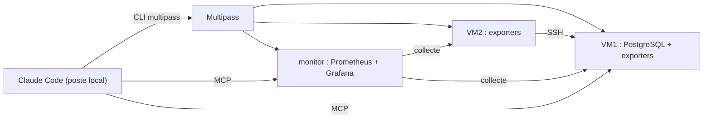

# Scénario agentique ops avec Claude Code

> **Objet :** pour chaque tâche ops du scénario, choisir **une seule** brique Claude Code (commande, skill, agent ou hook) et justifier ce choix. Le contenu des fichiers n'est pas détaillé ici.
>
> **Contrainte :** tout fonctionne **en local**. Les VM sont créées avec **Multipass**, la supervision repose sur **Prometheus** et **Grafana**. Aucun service cloud, aucune messagerie.

## 1. Contexte

Deux BA travaillent chacun sur une VM Multipass (**VM1** pour BA1, **VM2** pour BA2). Une troisième VM, **monitor**, héberge Prometheus et Grafana.

Claude Code doit prendre en charge sept tâches :

1. provisionner les VM ;
2. ouvrir et révoquer les accès SSH entre les VM ;
3. créer une base de données (PostgreSQL sur VM1) ;
4. gérer les permissions (comptes Linux, ACL, rôles de la base) ;
5. mettre en place la supervision (exporters, Prometheus, Grafana) ;
6. inspecter les logs ;
7. suivre les connexions : SSH réussies et refusées, connexions à la base.

Principe : l'agent propose et exécute, l'humain valide toute action sensible.

## 2. Règles de choix

| Brique | À choisir quand… | À éviter quand… |
| --- | --- | --- |
| **Commande** | Action ponctuelle, déclenchée **uniquement par l'humain**, décrite en quelques lignes | La procédure a besoin de scripts, de modèles ou de beaucoup de contexte |
| **Skill** | Procédure en plusieurs étapes, **réutilisée**, avec des fichiers d'appui (script, checklist, gabarit, configuration) | L'action est unique et triviale |
| **Agent** (sous-agent) | Tâche **volumineuse** ou à **isoler** : beaucoup de lecture, outils restreints, exécution en parallèle, résultat résumé | Une simple suite d'étapes suffit : l'agent ajoute du coût et de la latence |
| **Hook** | Une règle doit s'appliquer **à coup sûr**, sans dépendre du jugement du modèle | La règle demande de l'interprétation |
| **Serveur MCP** | Accès **structuré** à un service (base de données, Prometheus, Grafana) | Une commande shell locale suffit, comme la CLI `multipass` |

Dans Claude Code, une commande personnalisée et un skill s'invoquent tous deux par `/nom`. La différence tient au contenu : une commande est un prompt court ; un skill est un dossier qui contient une procédure et ses fichiers d'appui.

## 3. Décision par tâche

| # | Tâche | Brique retenue | Pourquoi ce choix |
| --- | --- | --- | --- |
| 1 | Provisionner une VM | **Commande** `/provision-vm` | Un appel à `multipass launch` avec un fichier cloud-init suffit : nom, CPU, mémoire, disque, image Ubuntu. Action sensible, donc déclenchée par un humain. Ni agent ni MCP nécessaires. |
| 2 | Ouvrir et révoquer un accès SSH | **Skill** `acces-ssh` | Procédure répétée à chaque arrivée et départ, avec des étapes fixes : compte, clé publique, test positif, test négatif, révocation. Le script de test et la checklist sont des fichiers d'appui. |
| 3 | Créer la base de données | **Commande** `/creer-db` | Opération ponctuelle en quelques étapes : installation de PostgreSQL sur VM1, base, rôle propriétaire, sauvegarde initiale. |
| 4 | Gérer les permissions | **Skill** `gestion-permissions` | Règles de moindre privilège réutilisées pour chaque personne et chaque ressource. Fichiers d'appui : matrice des droits et script d'audit avant et après. |
| 5 | Mettre en place la supervision | **Skill** `supervision` | Plusieurs étapes et des fichiers de configuration à livrer : `node_exporter` et `postgres_exporter`, script de comptage SSH, configuration Prometheus, règles d'alerte, tableau de bord Grafana. Réutilisable pour chaque nouvelle VM. |
| 6 | Inspecter les logs | **Agent** `log-inspector` | Gros volume de lecture qui encombrerait la session principale. L'agent est en lecture seule, analyse VM1 et VM2 en parallèle et ne renvoie qu'un résumé. |
| 7 | Suivre les connexions | **Skill** `rapport-connexions` | Il interroge Prometheus : les chiffres viennent des métriques, pas d'un comptage par le modèle. Il produit un rapport Markdown local, à partir d'un gabarit fourni dans le skill. |

### Pourquoi pas plus d'agents ?

- Provisionnement, SSH, base de données, permissions et supervision sont des **suites d'étapes séquentielles**. Un agent ne ferait que les exécuter dans un contexte séparé, sans rien apporter.
- Seule l'**inspection des logs** justifie un agent : c'est le seul cas où l'isolement du contexte, le parallélisme et la lecture seule apportent quelque chose.

## 4. Supervision : Prometheus et Grafana

### Rôle de chacun

| | **Prometheus** : collecte et stockage | **Grafana** : visualisation |
| --- | --- | --- |
| Rôle | Interroge les exporters à intervalle régulier, stocke les métriques et évalue les règles d'alerte | Affiche les métriques de Prometheus dans des tableaux de bord et présente les alertes |
| Données | Il **est** la source de données | Il ne stocke aucune métrique : il lit celles de Prometheus |
| Utilisé par | Claude Code, via le MCP Prometheus, pour obtenir des chiffres exacts (`/rapport-connexions`, `log-inspector`) | Les humains (BA1, BA2, ops), pour voir les tendances d'un coup d'œil |
| Sans l'autre | Fonctionne seul, avec une interface web basique | Ne fonctionne pas : il n'a rien à afficher |

En résumé : **Prometheus mesure, Grafana montre**. Claude lit les chiffres dans Prometheus ; les humains suivent l'état dans Grafana.

### Ce qui est collecté

| Source | Exporter | Métriques utiles |
| --- | --- | --- |
| Système des VM | `node_exporter` | CPU, mémoire, disque, VM joignable ou non |
| Connexions SSH | Script de comptage exposé par le *textfile collector* de `node_exporter` | Connexions acceptées, refusées et utilisateurs invalides, par VM |
| PostgreSQL | `postgres_exporter` | Connexions actives, échecs d'authentification, base joignable ou non |

Prometheus ne lit pas les logs SSH directement. Un petit script, installé par le skill `supervision`, compte les événements `sshd` et les publie sous forme de métriques.

### Tableau de bord Grafana

Un seul tableau de bord, **Connexions**, avec quatre panneaux :

1. connexions SSH acceptées, par VM ;
2. tentatives SSH refusées, par VM ;
3. connexions actives à PostgreSQL ;
4. état des VM et de la base : joignable ou non.

### Alertes locales

Les alertes sont définies dans Prometheus et affichées dans Grafana. Aucune notification externe n'est envoyée.

| Niveau | Condition indicative |
| --- | --- |
| **À surveiller** | Au moins 5 échecs SSH depuis une même source en une heure |
| **Critique** | Au moins 20 échecs SSH en une heure, VM injoignable ou base injoignable |

## 5. Briques transverses

Ces éléments ne correspondent pas à une tâche : ils s'appliquent à toutes.

### `CLAUDE.md` : règles du projet

- Annoncer le plan et attendre une validation avant toute création, suppression ou ouverture d'accès.
- Ne jamais afficher ni versionner de secrets.
- Moindre privilège pour les comptes Linux et les rôles de la base.
- Toute opération se termine par un test, y compris un test négatif pour les droits.
- Pour les chiffres, se fier à Prometheus plutôt qu'à une estimation.

### Hooks

| Hook | Événement | Rôle |
| --- | --- | --- |
| **garde-fou** | `PreToolUse` | Bloque les commandes destructrices (`multipass delete`, `multipass purge`, `rm -rf`, `DROP`) sans confirmation explicite |
| **anti-secret** | `PreToolUse` | Refuse l'écriture ou l'affichage de clés privées, de mots de passe ou de jetons |
| **audit** | `PostToolUse` | Journalise chaque action dans un fichier local : qui, quoi, quand, sur quelle VM |
| **verification-finale** | `Stop` | Empêche l'agent de conclure si les tests requis manquent |

### Serveurs MCP (tous locaux)

| Serveur | Utilisé par | Niveau d'accès |
| --- | --- | --- |
| **PostgreSQL** | `/creer-db` pour la vérification, `gestion-permissions` | Lecture seule ; les modifications passent par `psql` dans la VM, avec confirmation |
| **Prometheus** | `rapport-connexions`, `log-inspector` | Lecture seule (requêtes PromQL) |
| **Grafana** | `supervision` | Création et vérification du tableau de bord pendant l'installation ; les chiffres, eux, sont lus dans Prometheus |

Pas de MCP pour Multipass : sa CLI suffit. Pas de MCP pour les logs : ils sont lus par `multipass exec` ou par SSH.

### Permissions (`settings.json`)

Elles fixent les actions autorisées, soumises à confirmation ou interdites, en complément du hook **garde-fou**. Exemples : `multipass list` et `multipass info` autorisés, `multipass delete` soumis à confirmation. Les commandes intégrées `/permissions`, `/agents`, `/hooks` et `/mcp` permettent de vérifier la configuration.

## 6. Rapport de connexions

Rapport produit à la demande par `/rapport-connexions` et enregistré en Markdown dans le projet. Chiffres fictifs :

| Indicateur | VM1 | VM2 | Statut |
| --- | --- | --- | --- |
| Connexions SSH acceptées | 14 | 9 | OK |
| Tentatives SSH refusées | 0 | 6 (même source, entre 3 h et 4 h) | À surveiller |
| Connexions à la base (pic) | 12 (à 10 h) | — | OK |
| Échecs d'authentification à la base | 0 | — | OK |

Le rapport renvoie vers le tableau de bord Grafana pour le détail. En cas d'anomalie, l'agent `log-inspector` peut ensuite lire les logs sur la période concernée.

## 7. Déroulé type

| # | Étape | Brique | Validation humaine |
| --- | --- | --- | --- |
| 1 | Créer VM1, VM2 et monitor | `/provision-vm` | Oui |
| 2 | Donner à BA2 un accès SSH à VM1 | `/acces-ssh` | Oui |
| 3 | Créer la base sur VM1 | `/creer-db` | Oui |
| 4 | Appliquer les droits | `/gestion-permissions` | Oui |
| 5 | Installer la supervision | `/supervision` | Oui |
| 6 | Consulter le bilan des connexions | `/rapport-connexions` et Grafana | — |
| 7 | Analyser une anomalie | Agent `log-inspector` | — |
| 8 | Clôturer la mission | `/acces-ssh` (révocation), puis `multipass delete` sous contrôle du hook **garde-fou** | Oui |

Les hooks **garde-fou**, **audit** et **verification-finale** interviennent automatiquement à chaque étape.

## 8. Packaging en plugin

**C'est faisable.** Un plugin Claude Code peut regrouper commandes, skills, agents, hooks et serveurs MCP, puis s'installer d'un coup sur chaque poste.

Plugin proposé : **`ops-vm`**

| Contenu du plugin | Éléments |
| --- | --- |
| Commandes | `/provision-vm`, `/creer-db` |
| Skills | `acces-ssh`, `gestion-permissions`, `supervision`, `rapport-connexions` |
| Agent | `log-inspector` |
| Hooks | `garde-fou`, `anti-secret`, `audit`, `verification-finale` |
| Serveurs MCP | PostgreSQL, Prometheus, Grafana (adresses et jetons fournis par des variables d'environnement) |
| Manifeste | nom, version, description, auteur |

**Distribution locale :** le plugin est placé dans un dépôt Git, local ou interne, qui sert de *marketplace*. Chaque membre de l'équipe l'ajoute avec `/plugin marketplace add <chemin>`, puis l'installe avec `/plugin install ops-vm`.

**Hors plugin :**

- `CLAUDE.md` et les règles de permissions restent propres à chaque projet ;
- les secrets (mot de passe de la base, jeton Grafana) restent dans l'environnement de chaque utilisateur ;
- Multipass est installé séparément sur le poste.

## 9. Garde-fous

- Les **contrôles effectifs** restent côté système : comptes Linux, ACL, rôles PostgreSQL. Claude Code s'y ajoute sans les remplacer.
- Le seul agent (`log-inspector`) et les MCP de supervision sont en lecture seule.
- Toute action sensible passe par une confirmation humaine et laisse une trace d'audit locale.
